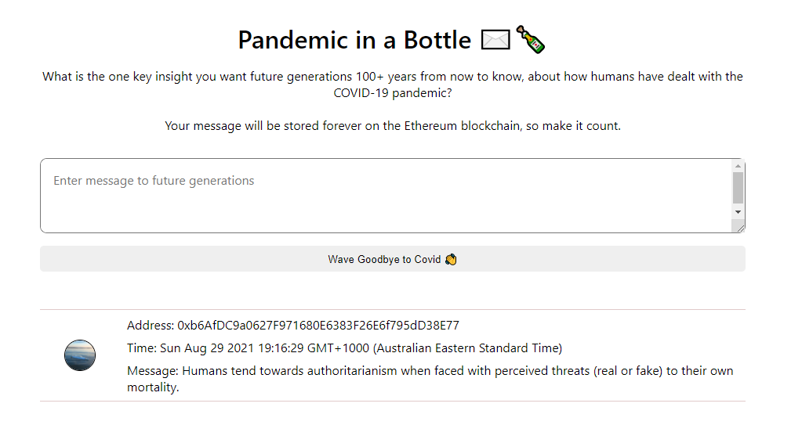

# Pandemic in a Bottle, UI: Ethereum, Web 3.0 Solidity App

This application is built and deployed on the Rinkeby Ethereum test network blockchain. This repo contains the solidity code which governs the smart contract functionality. The UI for this application can be found in a separate repo [here](https://github.com/NathanJReidy/pandemic-in-a-bottle-solidity-UI).

You can use this application to store a message about how humans have dealt with the Covid-19 pandemic. Your message will then be stored on the Rinkeby Ethereum test network.

The smart contract is coded in Solidity and has 0.1 Ethereum from the Rinkeby testnet pro-loaded onto it. Each user that submits a message has a 50% change of winning 0.0001 Ethereum.
A 10 second spam filter has been added to deter bots, which means you have to wait at least 10 seconds between submitting messages.

The smart contract address is 0x1125Bfc01daeaa3a9Ef1D0E3009c43DAA973F049. It can be viewed on the Ethereum Rinkeby testnet via Etherscan [here](https://rinkeby.etherscan.io/address/0x1125Bfc01daeaa3a9Ef1D0E3009c43DAA973F049).

Pre-requisites for using this application:

1. You need a [MetaMask wallet](https://metamask.io/).
2. You need to claim free Ethereum from the [Rinkeby Faucet](https://faucet.rinkeby.io/).

[Open the application](https://nathanjreidy.github.io/pandemic-in-a-bottle-solidity-UI/).
